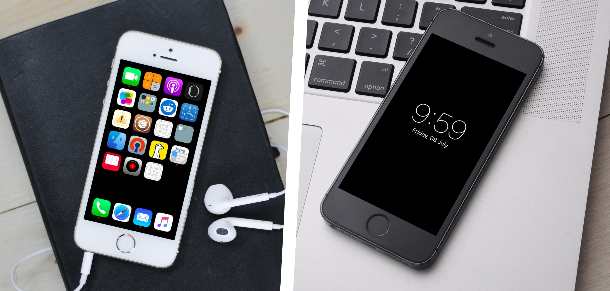

# Zen

## What it is
A "theme tweak" for a minimal look of iOS

## Requirements

This tweak is optimal
 - iOS 9.0.2 jailbroken
 - iPhone 5, 5s or SE (spacing on icons are optimised for this)
 
Also confirmed to work on 7.0.2/5C and 8.4/5S.
 

## How it looks like
Looks something like this, but better on the actual device.  

## How to get it 

Either download this repo and compile with theos. Or add this repo in Cydia and install the package http://www.jontelang.com/repo
